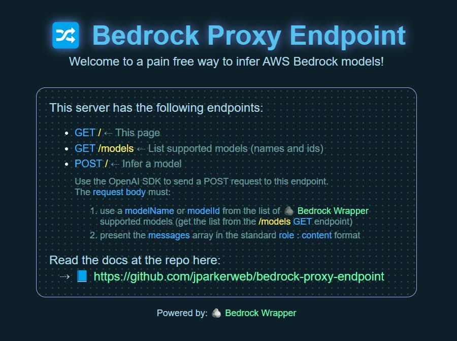

# 🪨 Bedrock Wrapper

Bedrock Wrapper is an npm package that simplifies the integration of existing OpenAI-compatible API objects with AWS Bedrock's serverless inference LLMs.  Follow the steps below to integrate into your own application, or alternativly use the 🔀 [Bedrock Proxy Endpoint](https://github.com/jparkerweb/bedrock-proxy-endpoint) project to spin up your own custom OpenAI server endpoint for even easier inference (using the standard `baseUrl`, and `apiKey` params).


---

### Maintained by
<a href="https://www.equilllabs.com">
  
</a>

---

### Install

- install package: `npm install bedrock-wrapper`

---

### Usage

1. import `bedrockWrapper`  
    ```javascript
    import { bedrockWrapper } from "bedrock-wrapper";
    ```

2. create an `awsCreds` object and fill in your AWS credentials  
    ```javascript
    const awsCreds = {
        region: AWS_REGION,
        accessKeyId: AWS_ACCESS_KEY_ID,
        secretAccessKey: AWS_SECRET_ACCESS_KEY,
    };
    ```

3. clone your openai chat completions object into `openaiChatCompletionsCreateObject` or create a new one and edit the values  
    ```javascript
    const openaiChatCompletionsCreateObject = {
        "messages": messages,
        "model": "Claude-4-5-Sonnet",
        "max_tokens": LLM_MAX_GEN_TOKENS,
        "stream": true,
        "temperature": LLM_TEMPERATURE,
        "stop_sequences": ["STOP", "END"], // Optional: sequences that will stop generation
    };
    ```

    the `messages` variable should be in openai's role/content format (not all models support system prompts)
    ```javascript
    messages = [
        {
            role: "system",
            content: "You are a helpful AI assistant that follows instructions extremely well. Answer the user questions accurately. Think step by step before answering the question. You will get a $100 tip if you provide the correct answer.",
        },
        {
            role: "user",
            content: "Describe why openai api standard used by lots of serverless LLM api providers is better than aws bedrock invoke api offered by aws bedrock. Limit your response to five sentences.",
        },
        {
            role: "assistant",
            content: "",
        },
    ]
    ```

    ***the `model` value should be the corresponding `modelName` value in the `bedrock_models` section below (see Supported Models below)***

4. call the `bedrockWrapper` function and pass in the previously defined `awsCreds` and `openaiChatCompletionsCreateObject` objects  
    ```javascript
    // create a variable to hold the complete response
    let completeResponse = "";
    // invoke the streamed bedrock api response
    for await (const chunk of bedrockWrapper(awsCreds, openaiChatCompletionsCreateObject)) {
        completeResponse += chunk;
        // ---------------------------------------------------
        // -- each chunk is streamed as it is received here --
        // ---------------------------------------------------
        process.stdout.write(chunk); // ⇠ do stuff with the streamed chunk
    }
    // console.log(`\n\completeResponse:\n${completeResponse}\n`); // ⇠ optional do stuff with the complete response returned from the API reguardless of stream or not
    ```

    if calling the unstreamed version you can call bedrockWrapper like this  
    ```javascript
    // create a variable to hold the complete response
    let completeResponse = "";
    if (!openaiChatCompletionsCreateObject.stream){ // invoke the unstreamed bedrock api response
        const response = await bedrockWrapper(awsCreds, openaiChatCompletionsCreateObject);
        for await (const data of response) {
            completeResponse += data;
        }
        // ----------------------------------------------------
        // -- unstreamed complete response is available here --
        // ----------------------------------------------------
        console.log(`\n\completeResponse:\n${completeResponse}\n`); // ⇠ do stuff with the complete response
    }

5. **NEW: Using the Converse API (optional)**
    
    You can now optionally use AWS Bedrock's Converse API instead of the Invoke API by passing `useConverseAPI: true` in the options parameter:
    ```javascript
    // Use the Converse API for unified request/response format across all models
    for await (const chunk of bedrockWrapper(awsCreds, openaiChatCompletionsCreateObject, { useConverseAPI: true })) {
        completeResponse += chunk;
        process.stdout.write(chunk);
    }
    ```
    
    The Converse API provides:
    - **Consistent API**: Single request/response format across all models
    - **Simplified conversation management**: Better handling of multi-turn conversations
    - **System prompts**: Cleaner separation of system instructions
    - **Tool use support**: Native support for function calling (where supported)
    - **Unified multimodal**: Consistent handling of text and image inputs

    **Note**: Some models only support the Converse API and will automatically use it regardless of the `useConverseAPI` flag:
    - DeepSeek-V3.1

---

### Supported Models

| modelName                  | AWS Model Id                                    | Image |
|----------------------------|-------------------------------------------------|-------|
| Claude-3-5-Haiku           | us.anthropic.claude-3-5-haiku-20241022-v1:0     |  ❌  |
| Claude-3-5-Sonnet          | us.anthropic.claude-3-5-sonnet-20240620-v1:0    |  ✅  |
| Claude-3-5-Sonnet-v2       | us.anthropic.claude-3-5-sonnet-20241022-v2:0    |  ✅  |
| Claude-3-7-Sonnet          | us.anthropic.claude-3-7-sonnet-20250219-v1:0    |  ✅  |
| Claude-3-7-Sonnet-Thinking | us.anthropic.claude-3-7-sonnet-20250219-v1:0    |  ✅  |
| Claude-3-Haiku             | us.anthropic.claude-3-haiku-20240307-v1:0       |  ✅  |
| Claude-4-Opus              | us.anthropic.claude-opus-4-20250514-v1:0        |  ✅  |
| Claude-4-Opus-Thinking     | us.anthropic.claude-opus-4-20250514-v1:0        |  ✅  |
| Claude-4-Sonnet            | us.anthropic.claude-sonnet-4-20250514-v1:0      |  ✅  |
| Claude-4-Sonnet-Thinking   | us.anthropic.claude-sonnet-4-20250514-v1:0      |  ✅  |
| Claude-4-1-Opus            | us.anthropic.claude-opus-4-1-20250805-v1:0      |  ✅  |
| Claude-4-1-Opus-Thinking   | us.anthropic.claude-opus-4-1-20250805-v1:0      |  ✅  |
| Claude-4-5-Haiku           | us.anthropic.claude-haiku-4-5-20251001-v1:0     |  ✅  |
| Claude-4-5-Haiku-Thinking  | us.anthropic.claude-haiku-4-5-20251001-v1:0     |  ✅  |
| Claude-4-5-Opus            | global.anthropic.claude-opus-4-5-20251101-v1:0  |  ✅  |
| Claude-4-5-Opus-Thinking   | global.anthropic.claude-opus-4-5-20251101-v1:0  |  ✅  |
| Claude-4-5-Sonnet          | us.anthropic.claude-sonnet-4-5-20250929-v1:0    |  ✅  |
| Claude-4-5-Sonnet-Thinking | us.anthropic.claude-sonnet-4-5-20250929-v1:0    |  ✅  |
| DeepSeek-R1                | us.deepseek.r1-v1:0                             |  ❌  |
| DeepSeek-V3.1              | deepseek.v3-v1:0                                |  ❌  |
| Gemma-3-4b                 | google.gemma-3-4b-it                            |  ✅  |
| Gemma-3-12b                | google.gemma-3-12b-it                           |  ✅  |
| Gemma-3-27b                | google.gemma-3-27b-it                           |  ✅  |
| GPT-OSS-120B               | openai.gpt-oss-120b-1:0                         |  ❌  |
| GPT-OSS-120B-Thinking      | openai.gpt-oss-120b-1:0                         |  ❌  |
| GPT-OSS-20B                | openai.gpt-oss-20b-1:0                          |  ❌  |
| GPT-OSS-20B-Thinking       | openai.gpt-oss-20b-1:0                          |  ❌  |
| Kimi-K2                    | moonshot.kimi-k2-thinking                       |  ❌  |
| Kimi-K2-Thinking           | moonshot.kimi-k2-thinking                       |  ❌  |
| Llama-3-8b                 | meta.llama3-8b-instruct-v1:0                    |  ❌  |
| Llama-3-70b                | meta.llama3-70b-instruct-v1:0                   |  ❌  |
| Llama-3-1-8b               | us.meta.llama3-1-8b-instruct-v1:0               |  ❌  |
| Llama-3-1-70b              | us.meta.llama3-1-70b-instruct-v1:0              |  ❌  |
| Llama-3-1-405b             | us.meta.llama3-1-405b-instruct-v1:0             |  ❌  |
| Llama-3-2-1b               | us.meta.llama3-2-1b-instruct-v1:0            |  ❌  |
| Llama-3-2-3b               | us.meta.llama3-2-3b-instruct-v1:0            |  ❌  |
| Llama-3-2-11b              | us.meta.llama3-2-11b-instruct-v1:0           |  ❌  |
| Llama-3-2-90b              | us.meta.llama3-2-90b-instruct-v1:0           |  ❌  |
| Llama-3-3-70b              | us.meta.llama3-3-70b-instruct-v1:0           |  ❌  |
| Magistral-Small-2509       | mistral.magistral-small-2509                 |  ❌  |
| MiniMax-M2                 | minimax.minimax-m2                           |  ❌  |
| Ministral-3-3b             | mistral.ministral-3-3b-instruct              |  ✅  |
| Ministral-3-8b             | mistral.ministral-3-8b-instruct              |  ✅  |
| Ministral-3-14b            | mistral.ministral-3-14b-instruct             |  ✅  |
| Mistral-7b                 | mistral.mistral-7b-instruct-v0:2             |  ❌  |
| Mistral-Large              | mistral.mistral-large-2402-v1:0              |  ❌  |
| Mistral-Large-3            | mistral.mistral-large-3-675b-instruct        |  ✅  |
| Mixtral-8x7b               | mistral.mixtral-8x7b-instruct-v0:1           |  ❌  |
| Nova-2-Lite                | us.amazon.nova-2-lite-v1:0                   |  ✅  |
| Nova-Micro                 | us.amazon.nova-micro-v1:0                    |  ❌  |
| Nova-Lite                  | us.amazon.nova-lite-v1:0                     |  ✅  |
| Nova-Pro                   | us.amazon.nova-pro-v1:0                      |  ✅  |
| Qwen3-32B                  | qwen.qwen3-32b-v1:0                          |  ❌  |
| Qwen3-235B-A22B-2507       | qwen.qwen3-235b-a22b-2507-v1:0               |  ❌  |
| Qwen3-Coder-30B-A3B        | qwen.qwen3-coder-30b-a3b-v1:0                |  ❌  |
| Qwen3-Coder-480B-A35B      | qwen.qwen3-coder-480b-a35b-v1:0              |  ❌  |
| Qwen3-Next-80B-A3B         | qwen.qwen3-next-80b-a3b                      |  ❌  |

To return the list progrmatically you can import and call `listBedrockWrapperSupportedModels`:  
```javascript
import { listBedrockWrapperSupportedModels } from 'bedrock-wrapper';
console.log(`\nsupported models:\n${JSON.stringify(await listBedrockWrapperSupportedModels())}\n`);
```

Additional Bedrock model support can be added.  
Please modify the `bedrock_models.js` file and submit a PR 🏆 or create an Issue.

---

### Thinking Models

Some models support extended reasoning capabilities through "thinking mode". These models include:
- **Claude models**: Claude-4-5-Opus-Thinking, Claude-4-1-Opus-Thinking, Claude-4-Opus-Thinking, Claude-4-5-Sonnet-Thinking, Claude-4-5-Haiku-Thinking, Claude-4-Sonnet-Thinking, Claude-3-7-Sonnet-Thinking
- **GPT-OSS models**: GPT-OSS-120B-Thinking, GPT-OSS-20B-Thinking
- **Kimi models**: Kimi-K2-Thinking (preserves reasoning tags in output)

To use thinking mode and see the model's reasoning process, set `include_thinking_data: true` in your request:

```javascript
const openaiChatCompletionsCreateObject = {
    "messages": messages,
    "model": "Claude-4-5-Sonnet-Thinking",
    "max_tokens": 4000,
    "stream": true,
    "temperature": 1.0, // Thinking models require temperature of 1.0
    "include_thinking_data": true // Enable thinking output
};

let completeResponse = "";
for await (const chunk of bedrockWrapper(awsCreds, openaiChatCompletionsCreateObject)) {
    completeResponse += chunk;
    process.stdout.write(chunk); // Shows both thinking and response
}
```

**Features:**
- Thinking content appears in `<think>...</think>` tags for Claude models
- Thinking content appears in `<reasoning>...</reasoning>` tags for GPT-OSS models
- Temperature is automatically set to 1.0 for optimal thinking performance
- Budget tokens are automatically calculated based on max_tokens

---

### Image Support

For models with image support (Claude 4+ series including Claude 4.5 Opus, Claude 4.5 Sonnet, Claude 4.5 Haiku, Claude 3.7 Sonnet, Claude 3.5 Sonnet, Claude 3 Haiku, Nova Pro, Nova Lite, Nova 2 Lite, Mistral Large 3, Ministral 3 series, and Gemma 3 series), you can include images in your messages using the following format (not all models support system prompts):

```javascript
messages = [
    {
        role: "system",
        content: "You are a helpful AI assistant that can analyze images.",
    },
    {
        role: "user",
        content: [
            { type: "text", text: "What's in this image?" },
            { 
                type: "image_url", 
                image_url: {
                    url: "data:image/jpeg;base64,/9j/4AAQSkZJRgABAQEA..." // base64 encoded image
                }
            }
        ]
    }
]
```

You can also use a direct URL to an image instead of base64 encoding:

```javascript
messages = [
    {
        role: "user",
        content: [
            { type: "text", text: "Describe this image in detail." },
            { 
                type: "image_url", 
                image_url: {
                    url: "https://example.com/path/to/image.jpg" // direct URL to image
                }
            }
        ]
    }
]
```

You can include multiple images in a single message by adding more image_url objects to the content array.

---

### Stop Sequences

Stop sequences are custom text sequences that cause the model to stop generating text. This is useful for controlling where the model stops its response.

```javascript
const openaiChatCompletionsCreateObject = {
    "messages": messages,
    "model": "Claude-3-5-Sonnet",
    "max_tokens": 100,
    "stop_sequences": ["STOP", "END", "\n\n"], // Array of stop sequences
    // OR use single string format:
    // "stop": "STOP"
};
```

**Model Support:**
- ✅ **Claude models**: Fully supported (up to 8,191 sequences)
- ✅ **Nova models**: Fully supported (up to 4 sequences)
- ✅ **GPT-OSS models**: Fully supported
- ✅ **Mistral models**: Fully supported (up to 10 sequences)
- ✅ **Qwen models**: Fully supported
- ✅ **Gemma models**: Fully supported
- ✅ **Kimi models**: Fully supported
- ✅ **MiniMax models**: Fully supported
- ❌ **Llama models**: Not supported (AWS Bedrock limitation)

**Features:**
- Compatible with OpenAI's `stop` parameter (single string or array)
- Also accepts `stop_sequences` parameter for explicit usage
- Automatic conversion between string and array formats
- Model-specific parameter mapping handled automatically

**Example Usage:**
```javascript
// Stop generation when model tries to output "7"
const result = await bedrockWrapper(awsCreds, {
    messages: [{ role: "user", content: "Count from 1 to 10" }],
    model: "Claude-3-5-Sonnet",  // Use Claude, Nova, Mistral, or Qwen models
    stop_sequences: ["7"]
});
// Response: "1, 2, 3, 4, 5, 6," (stops before "7")

// Note: Llama models will ignore stop sequences due to AWS Bedrock limitations
```

---

### Parameter Restrictions

Some AWS Bedrock models have specific parameter restrictions that are automatically handled by the wrapper:

#### Claude 4+ Models (Temperature/Top-P Mutual Exclusion)

**Affected Models:**
- Claude-4-5-Opus & Claude-4-5-Opus-Thinking
- Claude-4-5-Sonnet & Claude-4-5-Sonnet-Thinking
- Claude-4-5-Haiku & Claude-4-5-Haiku-Thinking
- Claude-4-Sonnet & Claude-4-Sonnet-Thinking
- Claude-4-Opus & Claude-4-Opus-Thinking
- Claude-4-1-Opus & Claude-4-1-Opus-Thinking

---

### 🧪 Testing

The package includes comprehensive test suites to verify functionality:

```bash
# Test all models with the Both APIs (Comparison)
npm run test

# Test all models with the Invoke API
npm run test:invoke

# Test all models with the Converse API
npm run test:converse

# Test vision/multimodal capabilities with Both APIs (Comparison)
npm run test-vision

# Test vision/multimodal capabilities with Invoke API
npm run test-vision:invoke

# Test vision/multimodal capabilities with Converse API
npm run test-vision:converse

# Test stop sequences functionality with Both APIs (Comparison)
npm run test-stop

# Test stop sequences functionality with Invoke API
npm run test-stop:invoke

# Test stop sequences functionality with Converse API
npm run test-stop:converse

# Test Converse API specifically
npm run test-converse

# Run all test suites
npm run test:all

# Interactive testing
npm run interactive
```

---

### 📢 P.S.

In case you missed it at the beginning of this doc, for an even easier setup, use the 🔀 [Bedrock Proxy Endpoint](https://github.com/jparkerweb/bedrock-proxy-endpoint) project to spin up your own custom OpenAI server endpoint (using the standard `baseUrl`, and `apiKey` params).



---

### 📚 References

- [AWS Meta Llama Models User Guide](https://docs.aws.amazon.com/bedrock/latest/userguide/model-parameters-meta.html)
- [AWS Mistral Models User Guide](https://docs.aws.amazon.com/bedrock/latest/userguide/model-parameters-mistral.html)
- [OpenAI API](https://platform.openai.com/docs/api-reference/chat/create)
- [AWS Bedrock](https://aws.amazon.com/bedrock/)
- [AWS SDK for JavaScript](https://aws.amazon.com/sdk-for-javascript/)

---

Please consider sending me a tip to support my work 😀
# [🍵 tip me here](https://ko-fi.com/jparkerweb)
